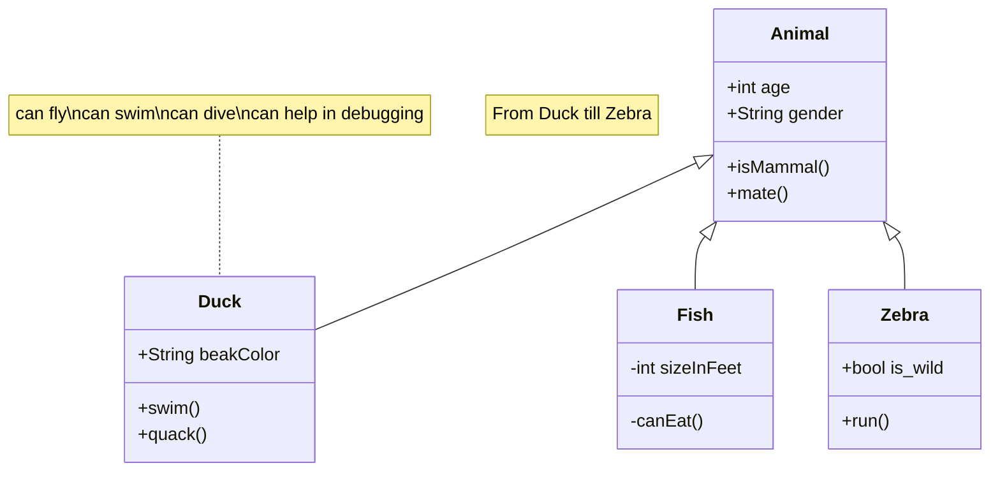
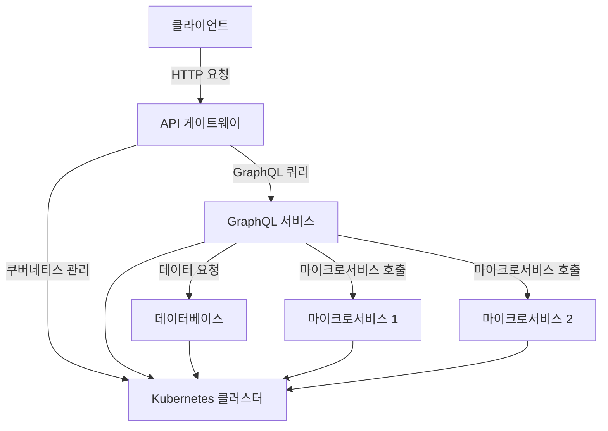
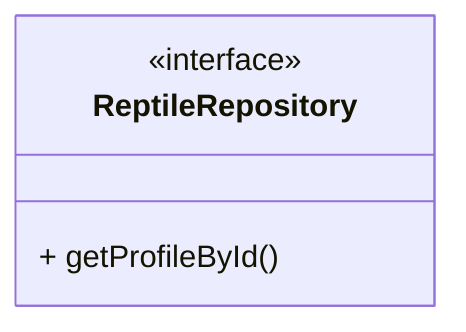

```mermaid

classDiagram
    note "From Duck till Zebra"
    Animal <|-- Duck
    note for Duck "can fly\ncan swim\ncan dive\ncan help in debugging"
    Animal <|-- Fish
    Animal <|-- Zebra
    Animal : +int age
    Animal : +String gender
    Animal: +isMammal()
    Animal: +mate()
    class Duck{
        +String beakColor
        +swim()
        +quack()
    }
    class Fish{
        -int sizeInFeet
        -canEat()
    }
    class Zebra{
        +bool is_wild
        +run()
    }
    

```

```mermaid

graph TD
    A[클라이언트] -->|HTTP 요청| B[API 게이트웨이]
    B -->|GraphQL 쿼리| C[GraphQL 서비스]
    C -->|데이터 요청| D[데이터베이스]
    C -->|마이크로서비스 호출| E[마이크로서비스 1]
    C -->|마이크로서비스 호출| F[마이크로서비스 2]
    B -->|쿠버네티스 관리| G[Kubernetes 클러스터]
    C --> G
    D --> G
    E --> G
    F --> G

```

```mermaid

classDiagram
		class ReptileRepository{ 
			<<interface>>
			+ getProfileById()
 }
		class ReptileRepository

```